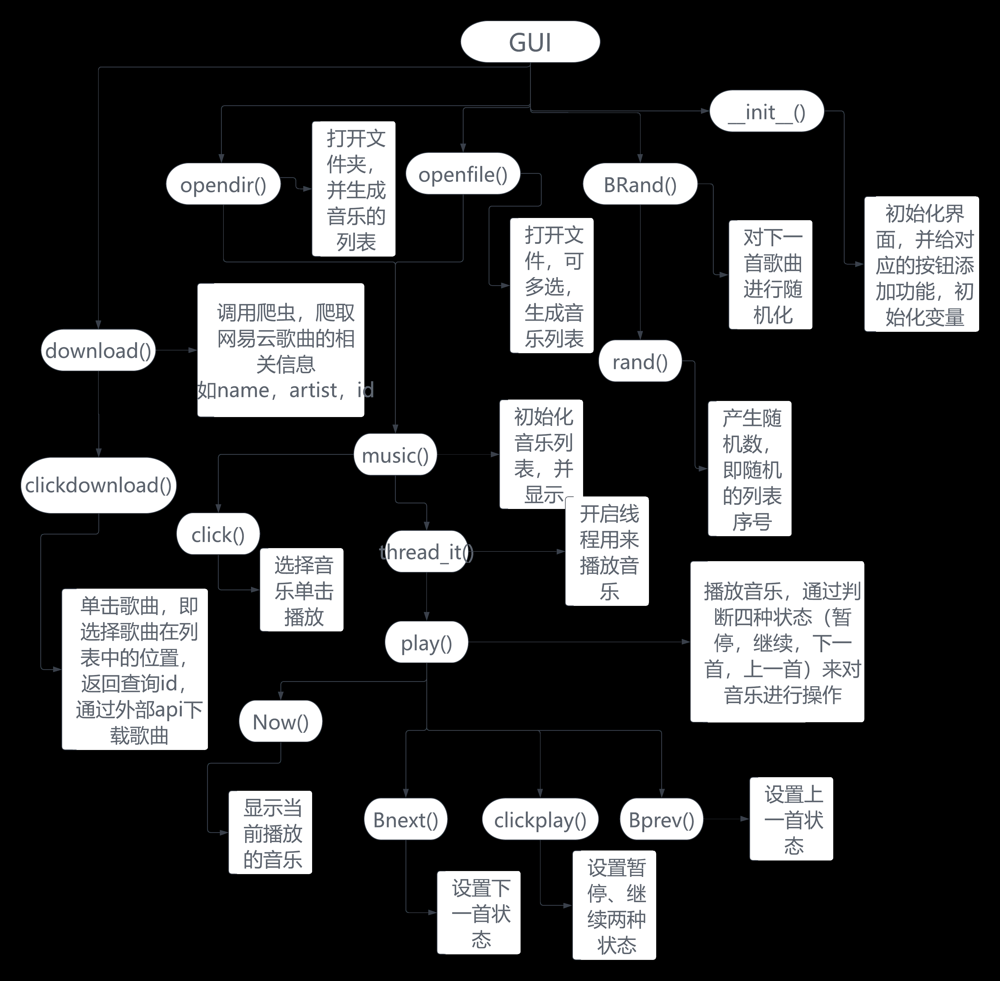

# Musicplayer
> Python 音乐播放器

##功能：
> &emsp;&emsp;首先可以实现本地音乐的播放，能够打开电脑端的文件，文件中进行多选，实现暂停、上一曲、下一曲的功能。在此基础上，完成随机播放列表和网络端下载的功能。

## 设计方法：
> &emsp;&emsp;本次开发使用Python语言，利用它的代码量少，现成库多，开发效率高的特点，同时觉得Qt设计的界面更加美观，而它恰好有PyQt5库，而PyQt5是基于Qt开发的，拥有大多数Qt的功能。  
>&emsp;&emsp;首先我们需要一个音乐播放器的界面，可用来设计界面的python库有Tkinter，PyQt5等，这里选择了设计简单，学习成本较低的PyQt5，来设计UI，通过QtDesigner软件，可以很快的做出一个界面，大大减少了开发成本，提高了效率。  
>&emsp;&emsp;音乐播放器的内部设计分为两个部分：一、本地音乐的打开与播放，二、网络音乐的搜索下载。本地音乐打开与播放时，首先选择文件夹，难题是如何使用鼠标选择文件中的某些歌曲。音乐的播放通过pygame模块进行控制。在学习过程中发现可以用爬虫实现网络音乐的下载，故学习如何使用爬虫技术进行爬取歌曲的id，然后调用外链进行下载。
## 用到的Python库：

- ### random用到random.randint()：

> &emsp;&emsp; random库是使用随机数的Python标准库,其中random.randint(a,b)随机生成一个（a,b）之间的整数，在本播放器中主要用于本地文件的随机播放。

- ### threading：

> &emsp;&emsp;多线程库，实现多个函数同时运行和爬虫，

- ### time用到time.sleep()：

> &emsp;&emsp;数推迟调用线程的运行，可通过参数secs指秒数，表示进程挂起的时间。播放音乐时，需要用到此函数进行播放的延迟

- ### os用到os.listdir() + os.path.basename()：

> &emsp;&emsp;返回指定路径下的文件和文件夹列表。
> os.path.basename(),返回path最后的文件名。若path以/或\结尾，那么就会返回空值。

- ### pygame：

> &emsp;&emsp;Pygame是被设计用来写游戏的python模块集合，Pygame是在优秀的SDL库之上开发的功能性包。使用python可以导入pygame来开发具有全部特性的游戏和多媒体软件，Pygame是极度轻便的并且可以运行在几乎所有的平台和操作系统上。此次程序设计中主要用来对音乐的播放暂停等控制。

- ### requests：

> &emsp;&emsp;在使用Python爬虫时，需要模拟发起网络请求，主要用到的库有requests库和python内置的urllib库，一般建议使用requests，它是对urllib的再次封装，其优势：Python爬虫时，更建议用requests库。因为requests比urllib更为便捷，requests可以直接构造get，post请求并发起，而urllib.request只能先构造get，post请求，再发起。

- ### PySide2：

> &emsp;&emsp;PySide2是基于Qt的官方Python库，提供了对Qt 5.122+框架的访问，可用于Python图形化界面开发，Qt是一种强大的图形用户界面构造工具。此次课程设计主要使用Qt进行相关界面的完善。

- ### cloudmusic：

> &emsp;&emsp;一个实现网易云爬虫的库，可实现音乐id、音乐名字、评论、歌单的爬取，并返回相关信息，自带下载外链(.m4a格式)。

### 播放界面：

### 下载界面：

### 程序设计流程图：

### 函数关系图：

### 尚未解决的问题：

[GitHub](https://github.com/menghuidream/Musicplayer)  
[Gitee](https://gitee.com/menghuidream/Musicplayer)  
